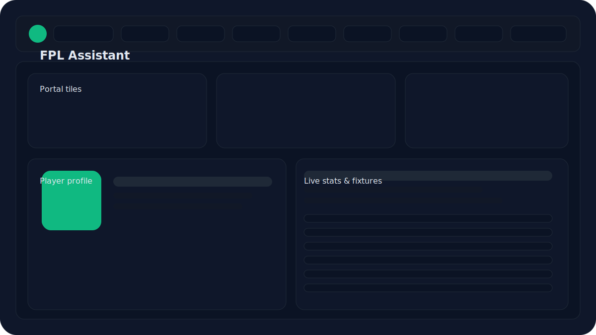

# FPL Assistant 🟢⚽️

Live-aware Fantasy Premier League dashboard that runs fully in the browser, backed by a Cloudflare Worker proxy for reliable images, CORS-safe API calls, and offline-friendly caching.

## Highlights

- **Player-first experience:** Every player photo is proxied through `/api/player-photo/:photoId` with local fallbacks—no broken faces.
- **Live-aware data:** Shows last finished GW, current live scores, and upcoming fixtures across pages.
- **Consistent UI kit:** Shared spacing, typography, buttons, cards, and chips for a cohesive feel.
- **Offline + error states:** Clear badges for online/offline/cache, reusable empty/error panels, and retry affordances.
- **Hash-based routing:** Portal, My Team, Players, Fixtures, GW Explorer, Stat Picker, Mini-League, and Help—plus friendly 404s.
- **Accessibility & mobile:** Touch-friendly targets, focusable navigation, and responsive layouts that avoid overflow.

## Screenshots / Visuals



## Getting Started

### Prerequisites

- Node.js 18+
- npm 9+

### Installation

```bash
npm install
```

### Local Development

1. Start a static server (any dev server that serves `index.html` works). Example:
   ```bash
   npx serve .
   # or
   python -m http.server 4173
   ```
2. Configure the API base (points to the Worker) via a local override:
   ```js
   // config.local.js (auto-loaded in local dev)
   window.__FPL_API_BASE__ = "http://localhost:8787/api";
   ```
3. Open the app (e.g., http://localhost:4173). Hash routing keeps navigation working on static hosting.

### Testing

```bash
npm test          # Runs the lightweight unit suite
npm run lint      # ESLint validation
npm run format    # Prettier check
```

## Usage

- **Portal:** Countdown, captain picks, and quick links. Click any player row/card to open the canonical player page.
- **Players:** Filter/search/sort, compute xP/xMins, and jump into profiles via row links.
- **Player page:** Live + previous GW breakdown, season stats, transfers, and expected metrics in one place.
- **Fixtures & Explorer:** Team/fixture difficulty insights with badges and responsive grids.
- **Offline awareness:** API badge indicates Online / Updating / Offline / Misconfigured with timestamps and tooltips.
- **Images:** All player photos are requested through `/api/player-photo/:photoId`. On 404 the UI falls back to locally bundled headshots or generated avatars so faces never break.

### Prefetch player photos (optional)

If you want every player cached locally for offline/edge deployments, run the fetcher:

```bash
node scripts/fetch-player-images.js
```

> If the script cannot reach the FPL CDN (e.g., network restricted), the app will still render generated avatars when a headshot is unavailable.

Pre-generated placeholders for IDs 1–900 already live under `assets/players/` to guarantee a face even when offline.

## Feature List

- Cloudflare Worker proxy for API + images (CORS-safe, cached).
- Player photos routed through `/api/player-photo/:photoId` with 24h cache headers.
- Local player asset fallbacks and generated avatars to avoid broken images.
- Responsive top bar with flex-wrapped status badge and theme toggle.
- Consistent buttons (primary/ghost), cards, chips, and spacing scale.
- Accessible navigation (ARIA labels, focus states, keyboard shortcuts).
- Standardized loading/error/empty state components.
- Friendly hash-route 404 with quick navigation links.

## Roadmap

- Add visual regression screenshots to README.
- Expand unit coverage to routing and image fallback behaviors.
- Sonar/static analysis setup in CI.
- Automated fetcher to pre-cache the latest season’s player headshots into `assets/players/`.

## Contributing

See [CONTRIBUTING.md](./CONTRIBUTING.md) for coding standards, branching strategy, and PR expectations.

## License

MIT © Myles
